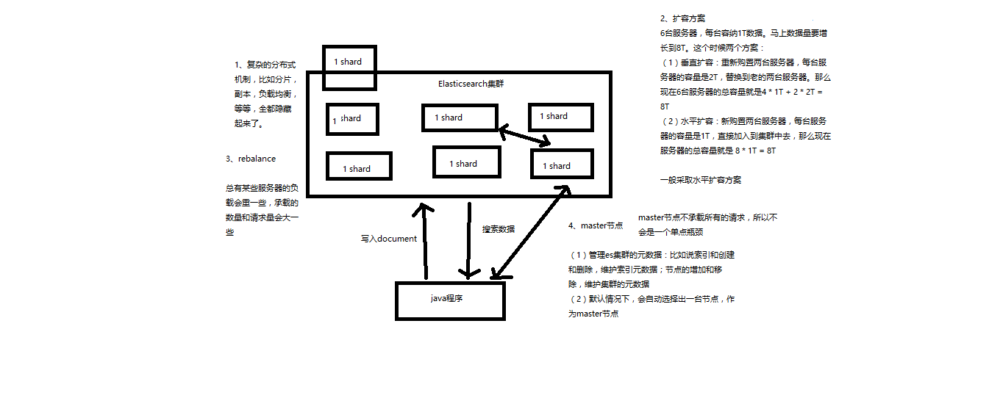
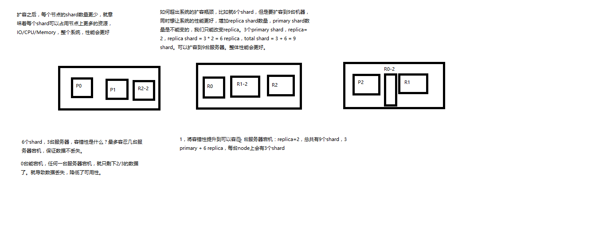
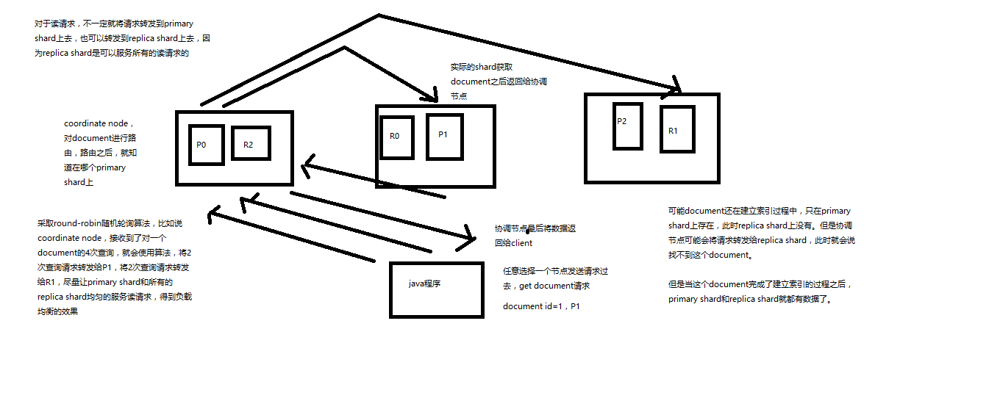

# Elasticsearch


## 简介

搜     索 ： 

数据做搜索 ：用数据库去搜索，就是一条条的找，效率低。（但是记录的文本很长，就要逐一扫描。而且模糊度不好 ”%牙膏%“ -> "牙刷膏" 就匹配不出来）

全文检索： 一下过程叫全文检索

例如 ：  要搜索 “生化危机”相关内容

| 1    |          生化危机电影          |
| ---- | :----------------------------: |
| 2    | 生化危机书籍 (生化 危机 书籍 ) |
| 3    | 生化危机音乐 (生化 危机 音乐 ) |
| 4    | 生化危机海报 (生化 危机 海报 ) |
| 5    | 生化危机图片 (生化 危机 图片 ) |

倒排索引 :  索引，文本都拆开（转至索引）

这里的ids 【1，2，3，4，5】是原文本的索引

“生化机”  =  “生化”  +  “机"  去搜索倒排索引表 结果匹配出来了1，2，3，4，5 这些id, 所对应的数据

| 关键词 |    ids    |
| :----: | :-------: |
|  生化  | 1,2,3,4,5 |
|  危机  | 1,2,3,4,5 |
|  电影  |     1     |
|  书籍  |     2     |
|  音乐  |     3     |
|  海报  |     4     |
|  图片  |     5     |


Lucene ： 简单讲就是一个jar 包，里面包含了倒排索引的代码。


Elasticsearch ： 基于Lucene

分布式：如果一条电脑上只有500G, 但是索引量远远大于这些，所以就要在多台电脑上部署Lucene，分布式的，如何管理散落在多台机器的搜索引引擎。就引入了Elasticsearch。

高可用：节点变多了，如果自己开发分布式很复杂，但是有了Elasticsearch就方便很多。

数据分析 ： 最近7天内，销量前十的牙膏品种。


elasticsearch核心概念 vs. 数据库核心概念

Elasticsearch			数据库

-----------------------------------------

Document			行   （每一条数据）
Type				      表   （类型）
Index				     库   （索引）


shard：单台机器无法存储大量数据，es可以将一个索引中的数据切分为多个shard，分布在多台服务器上存储。有了shard就可以横向扩展，存储更多数据，让搜索和分析等操作分布到多台服务器上去执行，提升吞吐量和性能。每个shard都是一个lucene index。

replica：任何一个服务器随时可能故障或宕机，此时shard可能就会丢失，因此可以为每个shard创建多个replica副本。replica可以在shard故障时提供备用服务，保证数据不丢失，多个replica还可以提升搜索操作的吞吐量和性能。

中小型企业：3分钟不部署完

【Cluster】 集群：一个集群由多个Node组成，用cluster name标识

【Node】   节点：每解压的一个ES就是一个node，一台机器可以有多个Node

【index】   索引：

【shard】   分片：每个索引有一个或多个分片，索引的数据被分配到各个shard上，每个shard都是一个Luence

【primary shard】主分片【replica shard】   副分片


## 安装 elasticsearch 

| 步骤1 | 安装 JDK 8+                      |
| ----- | -------------------------------- |
|       |                                  |
| 步骤2 | 解压ES安装包，看看各个目录结构。 |
|       |                                  |
|       |                                  |


## ES的分布式的基本原理

### 基本增删改查

| Document			行                                       | 即对应数据库里面的每条数据                                   |
| ------------------------------------------------------------ | ------------------------------------------------------------ |
| Type				       表                                | 对应数据库里面的Table                                        |
| Index                     库                                 | 对应数据库里面的database                                     |
| PUT /index/type/id<br/>{<br/>  "json数据"<br/>}              | 更新：索引的数据格式：es会自动建立index和type，不需要提前创建，而且es默认会对document每个field都建立倒排索引，让其可以被搜索 |
| GET /index/type/id                                           | 查询                                                         |
| DELETE /index/type/id                                        | 删除                                                         |
| POST /ecommerce/product/1/_update<br/>{<br/>  "doc": {<br/>    "name": "jiaqiangban gaolujie yagao"<br/>  }<br/>} | 替换                                                         |


| 查询命令                                                     | 返回结果                                                     | 字段含义                                                     |
| ------------------------------------------------------------ | ------------------------------------------------------------ | ------------------------------------------------------------ |
| query string search：GET /ecommerce/product/_search（查询所有_search API） | {<br/>  "took" : 1,<br/>  "timed_out" : false,<br/>  "_shards" : {<br/>    "total" : 5,<br/>    "successful" : 5,<br/>    "skipped" : 0,<br/>    "failed" : 0<br/>  },<br/>  "hits" : {<br/>    "total" : 2,<br/>    "max_score" : 1.0,<br/>    "hits" : [<br/>      {<br/>        "_index" : "ecommerce",<br/>        "_type" : "product",<br/>        "_id" : "2",<br/>        "_score" : 1.0,<br/>        "_source" : {<br/>          "name" : "jiajieshi yagao",<br/>          "desc" : "youxiao fangzhu",<br/>          "price" : 25,<br/>          "producer" : "jiajieshi producer",<br/>          "tags" : [<br/>            "fangzhu"<br/>          ]<br/>        }<br/>      },<br/>      {<br/>        "_index" : "ecommerce",<br/>        "_type" : "product",<br/>        "_id" : "3",<br/>        "_score" : 1.0,<br/>        "_source" : {<br/>          "name" : "zhonghua yagao",<br/>          "desc" : "caoben zhiwu",<br/>          "price" : 40,<br/>          "producer" : "zhonghua producer",<br/>          "tags" : [<br/>            "qingxin"<br/>          ]<br/>        }<br/>      }<br/>    ]<br/>  }<br/>} | took：耗费了几毫秒<br/>timed_out：是否超时，这里是没有<br/>_shards：数据拆成了5个分片，所以对于搜索请求，会打到所有的primary shard（或者是它的某个replica shard也可以）<br/>hits.total：查询结果的数量，3个document<br/>hits.max_score：score的含义，就是document对于一个search的相关度的匹配分数，越相关，就越匹配，分数也高<br/>hits.hits：包含了匹配搜索的document的详细数据 |
| GET /ecommerce/product/_search<br/>{ <br/>  "query": {<br/>    "match_all": {}<br/>  }<br/>} |                                                              | 查询所有：这个语法更强大                                     |
| GET /ecommerce/product/_search<br/>{<br/>  "query": {<br/>    "match": {<br/>      "name": "yagao"<br/>    }<br/>  },<br/>  <br/>  "sort":[<br/>    {"price": "desc"}<br/>    ]<br/>} |                                                              | 分条件查询                                                   |
| GET /ecommerce/product/_search<br/>{<br/>  "query": {<br/>    "match_all": {}<br/>  },<br/>  "from": 0,<br/>  "size": 1<br/>  <br/>} |                                                              | 分页查询 ：用两条数据查询1个                                 |
| GET /ecommerce/product/_search<br/>{<br/>  "query": {<br/>    "match_all": {}<br/>  },<br/>  "_source": ["name", "price"]<br/>} |                                                              | 部分查询                                                     |
| GET /ecommerce/product/_search<br/>{<br/>  "query": {<br/>    "bool": {<br/>      "must": <br/>        {"match":{<br/>          "name":"yagao"<br/>        }<br/>        },<br/>        "filter": {<br/>          "range": {<br/>            "price": {<br/>              "gte": 24,<br/>              "lte": 25<br/>            }<br/>          }<br/>        }<br/>      <br/>    }<br/>  }<br/>} |                                                              | 数据筛选：筛选 yagao，price 24-25                            |
| GET /ecommerce/product/_search<br/>{<br/>  "query": {<br/>    "match": {<br/>      "producer": "sp yaogao producer"<br/>    }<br/>  }<br/>} | producer这个字段，会先被拆解，建立倒排索引<br/><br/>special		 4<br/>yagao		  4<br/>producer	1,2,3,4<br/>gaolujie	   1<br/>zhognhua	3<br/>jiajieshi	     2 | 全文检索：看score 分数越高匹配度越高，越是匹配排行越靠前。只要能匹配到任何一个索引，都返回。（match_phrase：必须返回完全匹配的短语，所以返回null） |
| GET /ecommerce/product/_search<br/>{<br/>  "query": {<br/>    "match_phrase": {<br/>      "producer": "yagao"<br/>    }<br/>  },<br/>  "highlight": {<br/>    "fields": {<br/>      "producer": {}<br/>    }<br/>  }<br/>} |                                                              | 高亮：匹配的字符串被<em><em>被标记                           |


```json
{
  "took" : 3,
  "timed_out" : false,
  "_shards" : {
    "total" : 5,
    "successful" : 5,
    "skipped" : 0,
    "failed" : 0
  },
  "hits" : {
    "total" : 4,
    "max_score" : 0.8092568,
    "hits" : [
      {
        "_index" : "ecommerce",
        "_type" : "product",
        "_id" : "4",
        "_score" : 0.8092568,
        "_source" : {
          "name" : "sp yagao",
          "desc" : "sp meibai",
          "price" : 50,
          "producer" : "sp yagao producer"
        }
      },
      {
        "_index" : "ecommerce",
        "_type" : "product",
        "_id" : "5",
        "_score" : 0.5753642,
        "_source" : {
          "name" : "sp yagao1",
          "desc" : "sp meibai",
          "price" : 55,
          "producer" : "sp yagao producer",
          "tags" : [
            "mebai"
          ]
        }
      },
      {
        "_index" : "ecommerce",
        "_type" : "product",
        "_id" : "3",
        "_score" : 0.2876821,
        "_source" : {
          "name" : "zhonghua yagao",
          "desc" : "caoben zhiwu",
          "price" : 40,
          "producer" : "zhonghua producer",
          "tags" : [
            "qingxin"
          ]
        }
      },
      {
        "_index" : "ecommerce",
        "_type" : "product",
        "_id" : "2",
        "_score" : 0.19856805,
        "_source" : {
          "name" : "jiajieshi yagao",
          "desc" : "youxiao fangzhu",
          "price" : 25,
          "producer" : "jiajieshi producer",
          "tags" : [
            "fangzhu"
          ]
        }
      }
    ]
  }
}

```


### 聚合 ： aggregation = aggs

聚合 + 查询 + 分组 + 求平均值 

```json
{
    "size": 0, 
    "aggs": {
        "group_by_price": {
            "range": {
                "field": "price", 
                "ranges": [
                    {
                        "from": 0, 
                        "to": 20
                    }, 
                    {
                        "from": 20, 
                        "to": 40
                    }, 
                    {
                        "from": 40, 
                        "to": 50
                    }
                ]
            }, 
            "aggs": {
                "group_by_tags": {
                    "terms": {
                        "field": "tags", 
                        "order": {
                            "avg_price": "desc"
                        }
                    }, 
                    "aggs": {
                        "avg_price": {
                            "avg": {
                                "field": "price"
                            }
                        }
                    }
                }
            }
        }
    }
}
```


集群：

解压2个elasticsearch ：分别改端口

查看健康状态

------


### ElasticSearch 基础分布架构

特点 ： 分布式机制，为了应对大数据量。但是底层对我们已经隐藏了复杂的机制。使得可以解压后直接应用。使用者只需要把数据放进去（调用API，写入document），然后进行聚合搜索等查询。不必关心集群的每个节点是如何处理。

扩容：问题6T增加到8T

| 水平扩容                                                     | 垂直扩容                                                     |
| ------------------------------------------------------------ | ------------------------------------------------------------ |
| 优先选择，直接加到集群中去（2台2T的直接加到集群），采购越来越多的普通服务器 | 替换两个服务器（买2更大的内存服务器“替换”2个）采购内存大的服务会有瓶颈，价格也与越来越高 |



master节点：

只做一些轻量级的处理，防止阻碍ElasticSearch的整体性能。

（1）创建或删除索引
（2）增加或删除节点

节点对等的分布式架构：

集群里的所有节点都是对等的，能做的工作也是一样的，把请求发给谁都一样。

------


### Shard 和 Replica

每个Shard的底层都是Lucene的实例，可以完整的建立索引和处理请求。

自动的把Shard均衡到所有节点上去。（负载均衡）

一个document只会存在一个shard里，不会重复存

primary shard 与 replica shard不会放在同一节点上，因为当一个节点挂掉所有数据都会同时丢失，这样没有意义。如果节点不够暂时不会分配副本

两个Node下的Shard  和 Replica的分配: 当一个master node配置成功了，另一node完全拷贝其数据，作为replica，java程序分别可以访问这2个node内数据

| primary shard      | replica shard                           |
| ------------------ | --------------------------------------- |
|                    | 是primary shard的副本，存的数据完全一样 |
| primary shard挂掉  | 负责容错，以及承担读请求负载            |
| 数量在创建时候固定 | 数量随时可以更改                        |


### 横向扩容

极限：有多少个shard,最多扩容到多少台机器

当有6个shard时候，最多扩容到6台机器（每台机器个shard）此时性能最好。极限

但是6个shard要扩容到9台机器上，此时只能是增加 3个replica shard，性能也好。

容错性：3台服务器6个shard时允许一个宕机。如服务器3宕机了，服务1和服务器2有所有的数据（1，2，3）

|    服务器1    |    服务器2    |    服务器3    |
| :-----------: | :-----------: | :-----------: |
| **P1**   *R2* | **P2**   *R3* | **P3**   *R1* |


3台服务器9个shard时，可以允许2台服务器宕机，容错性很高，还节约服务器资源。如服务器2和3都宕机了，服务器1还有所有数据。

|        服务器1Master        |          服务器2           |          服务器3           |
| :-------------------------: | :------------------------: | :------------------------: |
| **P1**   *R2*   `R3(副本2)` | **P2**   *R3*  `R1(副本2)` | **P3**   *R1*  `R2(副本2)` |



### Elasticsearch容错机制

|  第一步(Red)   | master选举                                                   |
| :------------: | ------------------------------------------------------------ |
| 第二步(yellow) | replica容错：新master把丢失的Primary shard 的某一个Replica shard 升级Primary shard, 但是因为服务1宕机，虽然此时的P shard 均为 active但是少了一个R shard ,不是所有的R shard为活跃，为yellow Status |
| 第三步(green)  | 数据恢复：重启故障Node，此时new master将缺失的副本copy上去，同步宕机之后发生的数据修改。R 和 P都齐全切活跃，为green status |

## Document

### Document 的核心源数据

插入一条数据后返回的Document 

```json
{
  "_index" : "test_index",
  "_type" : "test_type",
  "_id" : "1",
  "_version" : 1,
  "result" : "created",
  "_shards" : {
    "total" : 2,
    "successful" : 1,
    "failed" : 0
  },
  "_seq_no" : 0,
  "_primary_term" : 1
}
```

| _index 源数据 | （1）代表一个document存放在哪个index中<br/>（2）类似的数据放在一个索引，非类似的数据放不同索引：product index（包含了所有的商品），sales index（包含了所有的商品销售数据），inventory index（包含了所有库存相关的数据）。如果你把比如product，sales，human resource（employee），全都放在一个大的index里面，比如说company index，不合适的。<br/>（3）index中包含了很多类似的document：类似是什么意思，其实指的就是说，这些document的fields很大一部分是相同的，你说你放了3个document，每个document的fields都完全不一样，这就不是类似了，就不太适合放到一个index里面去了。<br/>（4）索引名称必须是小写的，不能用下划线开头，不能包含逗号：product，website，blog |
| :------------ | ------------------------------------------------------------ |
| _type源数据   | （1）代表document属于index中的哪个类别（type）<br/>（2）一个索引通常会划分为多个type，逻辑上对index中有些许不同的几类数据进行分类：因为一批相同的数据，可能有很多相同的fields，但是还是可能会有一些轻微的不同，可能会有少数fields是不一样的，举个例子，就比如说，商品，可能划分为电子商品，生鲜商品，日化商品，等等。（3）type名称可以是大写或者小写，但是同时不能用下划线开头，不能包含逗号 |
| _id源数据     | （1）代表document的唯一标识，与index和type一起，可以唯一标识和定位一个document<br/>（2）我们可以手动指定document的id（put /index/type/id），也可以不指定，由es自动为我们创建一个id |


### document id 

|                           自动生成                           |            手动生成             |
| :----------------------------------------------------------: | :-----------------------------: |
|                       post /index/type                       |                                 |
| 自动生成的id，长度为20个字符，URL安全，base64编码，GUID算法<br/>分布式系统并行生成时不可能会发生冲突(保证同一时间生成的id也不会重复) | PUT 数据时所定义的id 1,2,3..... |


### _source源数据

_source源数据：是 request body 中的json字符串，默认是返回所有。

可以指定field返回值

```json
GET /test_index/test_type/2?_source=test_content

{
  "_index" : "test_index",
  "_type" : "test_type",
  "_id" : "2",
  "_version" : 1,
  "_seq_no" : 0,
  "_primary_term" : 2,
  "found" : true,
  "_source" : {
    "test_content" : "test_2"
  }
}

```


### 创建

|                      doucument全量替换                       |                      document 强制创建                       |
| :----------------------------------------------------------: | :----------------------------------------------------------: |
| 在已有的id 上修改内容，version会由1加到2，原来的1版本被标记deleted，再次get时会get出最新版本，ES会在适当时机真正删除 | PUT test_index/test_type/4/_create<br/>{<br/>  "test_content3":"test_3_2"<br/>} |

### Elasticsearch并发冲突

会存在一种问题：多个ES线程,在同时访问或修改同一个数据，会导致数据错乱。


| 悲观锁并发控制方案                                           | 乐观锁并发控制方案                                           |
| ------------------------------------------------------------ | ------------------------------------------------------------ |
| 在各种不同情况下都上不同锁（行级，表级，读锁写锁），         |                                                              |
| 线程A先获取到了“商品的锁”，此时B线程也要访问此商品，但是被锁住了读不到数据。 |                                                              |
| 方便，并发能力低                                             | 数据并发能力高，不给数据加锁。但是每次都要对比版本号，麻烦。 |


### Elasticsearch内部基于_version进行乐观锁并发控制

很多进程在修改同一份数据，根据版本号判断。注意：数据删除也会记录到版本表。从而证明ES是假删除不是真删除。

版本是从1开始的

```json
1. 打开2个终端

2. 加上版本号去修改：如果数据其间被修改过其版本就有变过，就会报错409.但是如果不加版本号就可以重复更新，每次版本号加一
/*================================ 更新语句 ================================================*/
PUT test_index/test_type/6?version=1
{
  "test_content":"test6_1"
}

/*=============================== 返回结果 ================================================*/
{
  "_index" : "test_index",
  "_type" : "test_type",
  "_id" : "6",
  "_version" : 2,
  "result" : "updated",
  "_shards" : {
    "total" : 2,
    "successful" : 1,
    "failed" : 0
  },
  "_seq_no" : 3,
  "_primary_term" : 3
}

/*================================= 报错结果 ===============================================*/
{
  "error": {
    "root_cause": [
      {
        "type": "version_conflict_engine_exception",
        "reason": "[test_type][6]: version conflict, current version [5] is different than the one provided [1]",
        "index_uuid": "BqRCjQjdR1KbMRhrMyEgCA",
        "shard": "2",
        "index": "test_index"
      }
    ],
    "type": "version_conflict_engine_exception",
    "reason": "[test_type][6]: version conflict, current version [5] is different than the one provided [1]",
    "index_uuid": "BqRCjQjdR1KbMRhrMyEgCA",
    "shard": "2",
    "index": "test_index"
  },
  "status": 409
}
```


### 基于external version进行乐观锁并发控制

有些情况要基于数据库内程序自己存储的版本号，来控制版本，而不是基于ES的version 。

```json
1. 
/*====================================== 构造原始数据 =================================================*/
PUT test_index/test_type/7
{
  "context":"test7"
}

/*====================================== 构造版本2数据version_type=external ============================*/
PUT test_index/test_type/7?version=2&version_type=external
{
  "test_content":"test7_1"
}

/*====================================== 返回结果 =====================================================*/
{
  "_index" : "test_index",
  "_type" : "test_type",
  "_id" : "7",
  "_version" : 2,
  "result" : "updated",
  "_shards" : {
    "total" : 2,
    "successful" : 1,
    "failed" : 0
  },
  "_seq_no" : 2,
  "_primary_term" : 3
}
```


### partial update 快速的部分更新

partial update：每次只需要POST修改的数据，不用提交全量数据，不用提前查了。

优点：减少因查询数据造成时间间隔过长，而引发的并发冲突问题。

```json
post /index/type/id/_update 
{
   "doc": {
      "要修改的少数几个field即可，不需要全量的数据"
   }
}

```

```json
PUT /index/type/id，创建文档&替换文档，就是一样的语法(比较慢的方法)

一般对应到应用程序中，每次的执行流程基本是这样的：

（1）应用程序先发起一个get请求，获取到document，展示到前台界面，供用户查看和修改
（2）用户在前台界面修改数据，发送到后台
（3）后台代码，会将用户修改的数据在内存中进行执行，然后封装好修改后的全量数据
（4）然后发送PUT请求，到es中，进行全量替换
（5）es将老的document标记为deleted，然后重新创建一个新的document

```

### 基于groovy 脚本执进行partial update

ES支持基于脚本实现各种复杂操作

内置脚本

```json
/*========================= 构造数据======================================*/
PUT /test_index/test_type/11
{
  "num": 0,
  "tags": []
}

/*========================== 写脚本 ======================================*/
POST /test_index/test_type/11/_update
{
   "script" : "ctx._source.num+=1"
}

/*========================== 返回结果 =====================================*/
GET test_index/test_type/11

{
  "_index" : "test_index",
  "_type" : "test_type",
  "_id" : "11",
  "_version" : 2,
  "_seq_no" : 3,
  "_primary_term" : 3,
  "found" : true,
  "_source" : {
    "num" : 1,
    "tags" : [ ]
  }
}
```


外部脚本：复杂的脚本写到脚本文件中,脚本文件放在如下目录？（6.8 没有生效）


```json
POST /test_index/test_type/11/_update
{
  "script": {
    "lang": "groovy", 
    "file": "test-add-tags",
    "params": {
      "new_tag": "tag1"
    }
  }
}

/* ============================ 报错找不到文件 ================================*/
```


### mget 批量查询


可以说mget是很重要的，一般来说，在进行查询的时候，如果一次性要查询多条数据的话，那么一定要用batch批量操作的api
尽可能减少网络开销次数，可能可以将性能提升数倍，甚至数十倍，非常非常之重要

```json
/*=========================== 批量查询（1）====================================*/

GET /_mget
{
   "docs" : [
      {
         "_index" : "test_index",
         "_type" :  "test_type",
         "_id" :    1
      },
      {
         "_index" : "test_index",
         "_type" :  "test_type",
         "_id" :    2
      }
   ]
}

/*======================= 批量查询（相同 index）============================*/
GET /test_index/_mget
{
   "docs" : [
      {
         "_type" :  "test_type",
         "_id" :    1
      },
      {
         "_type" :  "test_type",
         "_id" :    2
      }
   ]
}

/*======================= 批量查询（相同index和type）============================*/
GET /test_index/test_type/_mget
{
   "docs" : [
      {
         "_id" :    1
      },
      {
         "_id" :    2
      }
   ]
}

/*======================= 批量查询（相同index和type）============================*/
GET /test_index/test_type/_mget
{
   "ids":[1,2]
}
```


### bulk  批量增删改

bulk ： 同一条命令不能换行

bulk size最佳大小：bulk request会加载到内存里，如果太大的话，性能反而会下降，因此需要反复尝试一个最佳的bulk size。一般从1000~5000条数据开始，尝试逐渐增加。另外，如果看大小的话，最好是在5~15MB之间。

```json
POST /_bulk
{ "delete": { "_index": "test_index", "_type": "test_type", "_id": "3" }} 
{ "create": { "_index": "test_index", "_type": "test_type", "_id": "12" }}
{ "test_field":    "test12" }
{ "index":  { "_index": "test_index", "_type": "test_type", "_id": "2" }}
{ "test_field":    "replaced test2" }
{ "update": { "_index": "test_index", "_type": "test_type", "_id": "1", "_retry_on_conflict" : 3} }
{ "doc" : {"test_field2" : "bulk test1"} }
```


## 第一阶段总结

1.最核心的功能，就是一个分布式的文档数据存储系统

2.文档数据：es可以存储和操作json文档类型的数据，而且这也是es的核心数据结构。
3.存储系统：es可以对json文档类型的数据进行存储，查询，创建，更新，删除，等等操作。其实ES满足了这些功能，就可以说已经是一个NoSQL的存储系统了。

4.围绕着document在操作，其实就是把es当成了一个NoSQL存储引擎，一个可以存储文档类型数据的存储系统，在操作里面的document。

es可以作为一个分布式的文档存储系统，所以说，我们的应用系统，是不是就可以基于这个概念，去进行相关的应用程序的开发了。

（1）数据量较大，es的分布式本质，可以帮助你快速进行扩容，承载大量数据
（2）数据结构灵活多变，随时可能会变化，而且数据结构之间的关系，非常复杂，如果我们用传统数据库，那是不是很坑，因为要面临大量的表
（3）对数据的相关操作，较为简单，比如就是一些简单的增删改查，用我们之前讲解的那些document操作就可以搞定
（4）NoSQL数据库，适用的也是类似于上面的这种场景

举个例子，比如说像一些网站系统，或者是普通的电商系统，博客系统，面向对象概念比较复杂，但是作为终端网站来说，没什么太复杂的功能，就是一些简单的CRUD操作，而且数据量可能还比较大。这个时候选用ES这种NoSQL型的数据存储，比传统的复杂的功能务必强大的支持SQL的关系型数据库，更加合适一些。无论是性能，还是吞吐量，可能都会更好。


## 分布式文档系统

### Document 数据路由原理

document路由到shard上：是来了一个Document它应该存到那个Shard上这一过程

路由算法：shard = hash(routing) % number_of_primary_shards

primary shard数量不可变的原因：如果变了就会导致document没有地方可存，数据丢失

举个例子：

| 1.   | 一个index有3个primary shard，P0，P1，P2                      |
| ---- | ------------------------------------------------------------ |
| 2    | 每次增删改查一个document的时候，都会带过来一个routing number，默认就是这个document的id=1 |
| 3    | 会将这个routing值，传入一个hash函数中，产出一个routing值的hash值，hash(routing) = 21<br/>然后将hash函数产出的值对这个index的primary shard的数量求余数，21 % 3 = 0<br/>就决定了，这个document就放在P0上。 |
| 4    | 默认的routing就是_id<br/>也可以在发送请求的时候，手动指定一个routing value，比如说put /index/type/id?routing=user_id |


### Document 增删改的内部原理

增删改：只能是在 primary shard

| 步骤 1 | 客户端任意选择Node 节点发送请求                              |
| ------ | ------------------------------------------------------------ |
| 步骤 2 | 此时这个node就变成协调节点 coordinate node                   |
| 步骤 3 | 用路由算法对document进行路由                                 |
| 步骤 4 | 把document对应的请求转发到primary shard上去，并进行完增删改操作，同步到副本数据中去（副本也做完同样的操作P1 把数据同步到R1上去） |
| 步骤 5 | 协调节点把相应结果返回给Client客户端                         |


### Document 查询的内部原理

| 步骤 1 | 客户端任意选择Node 节点发送请求                              |
| ------ | ------------------------------------------------------------ |
| 步骤 2 | 此时这个node就变成协调节点coordinate node                    |
| 步骤 3 | 用路由算法对document进行路由（round-robin随机轮询算法，在primary shard以及其所有replica中随机选择一个，让读请求负载均衡） |
| 步骤 4 | 接收请求的node返回document给coordinate node                  |
| 步骤 5 | 协调节点把相应结果返回给Client客户端                         |

特殊情况：document如果还在建立索引过程中，可能只有primary shard有，任何一个replica shard都没有，此时可能会导致无法读取到document，
                   但是document完成索引建立之后，primary shard和replica shard就都有了




### 写一致性原理 consistency

定义一种规则保证一致性：例如6 个shard 必须有3个shard活跃才能保证写

quorum 机制：写之前必须保证大多数shard可用
$$
quroum = int( (primary + numberOfReplicas) / 2 ) + 1
$$
例如：6 个shard 必须有3个shard是活跃才能开始写操作

es提供了一种特殊的处理场景，就是说当number_of_replicas>1时才生效

可以在写操作的时候，加一个timeout参数，比如说put /index/type/id?timeout=30【毫秒】，这个就是说自己去设定quorum不齐全的时候，es的timeout时长，可以缩短，也可以增长


### bulk 奇怪的json格式与性能

bulk api奇特的json格式 ： ES 按照两行（两个\n）为一组去解析

```json
{"action": {"meta"}}\n
{"data"}\n
{"action": {"meta"}}\n
{"data"}\n
```


| 缺点1                                                        | 优点1                                                        |
| :----------------------------------------------------------- | ------------------------------------------------------------ |
| 1.   bulk中的每个操作都可能要转发到不同的node的shard去执行<br/>2.   如果采用比较良好的json数组格式<br/>允许任意的换行，整个可读性非常棒，读起来很爽，es拿到那种标准格式的json串以后，要按照下述流程去进行处理<br/>（1）将json数组解析为JSONArray对象，这个时候，整个数据，就会在内存中出现一份一模一样的拷贝，一份数据是json文本，一份数据是JSONArray对象<br/>（2）解析json数组里的每个json，对每个请求中的document进行路由<br/>（3）为路由到同一个shard上的多个请求，创建一个请求数组<br/>（4）将这个请求数组序列化<br/>（5）将序列化后的请求数组发送到对应的节点上去 | 现在的奇特格式<br/>{"action": {"meta"}}\n<br/>{"data"}\n<br/>{"action": {"meta"}}\n<br/>{"data"}\n<br/>（1）不用将其转换为json对象，不会出现内存中的相同数据的拷贝，直接按照换行符切割json<br/>（2）对每两个一组的json，读取meta，进行document路由<br/>（3）直接将对应的json发送到node上去 |


| 缺点2                                                        | 优点2                                                        |
| ------------------------------------------------------------ | ------------------------------------------------------------ |
| 费更多内存，更多的jvm gc开销<br/><br/>我们之前提到过bulk size最佳大小的那个问题，一般建议说在几千条那样，然后大小在10MB左右，所以说，可怕的事情来了。假设说现在100个bulk请求发送到了一个节点上去，然后每个请求是10MB，100个请求，就是1000MB = 1GB，然后每个请求的json都copy一份为jsonarray对象，此时内存中的占用就会翻倍，就会占用2GB的内存，甚至还不止。因为弄成jsonarray之后，还可能会多搞一些其他的数据结构，2GB+的内存占用。<br/><br/>占用更多的内存可能就会积压其他请求的内存使用量，比如说最重要的搜索请求，分析请求，等等，此时就可能会导致其他请求的性能急速下降<br/>另外的话，占用内存更多，就会导致java虚拟机的垃圾回收次数更多，跟频繁，每次要回收的垃圾对象更多，耗费的时间更多，导致es的java虚拟机停止工作线程的时间更多 | 最大的优势在于，不需要将json数组解析为一个JSONArray对象，形成一份大数据的拷贝，浪费内存空间，尽可能地保证性能 |


## 搜索引擎

### 搜索结内容解析

```JSON
整个请求“打”到了多少个shards 上去（正常情况下一个搜索请会打到一个index的所有primary shard上去，当然了，每个primary shard都可能会有一个或多个replic shard，所以请求也可以到primary shard的其中一个replica shard上去。）

默认不加 time_out: 会查询回所有的数据无论时间多长，但是很多涉及用户体验的，如：电商网站查10分钟用户流失了

GET /_search?timeout=10ms : 10ms查询时间内查询回20条，不加timeout会把所有都查回来

{
    "took": 1,							// 1. 整个搜索请求花费多少毫秒
    "timed_out": false,
    "_shards": {
        "total": 5,						//  一共打到了多少shards 上去
        "successful": 5,				// 成功了多少个
        "skipped": 0,					// 略过了多少
        "failed": 0						// 失败了多少
    },
    "hits": {
        "total": 361632,       			// 本次搜索，返回结果条数据
        "max_score": 1.0,				// 本次搜索最大的相关度分数是，每一条document对于search的相关度，越相关，_score分数越大，排位越靠前）
        "hits": [						// hits.hits 查询回的结果（默认前十条的完整数据）
            {
                "_index": "fulongtech_item",
                "_type": "_doc",
                "_id": "45f22784-ce68-4b19-864e-55b6b1032e24",
                "_score": 1.0, 												
                "_source": {
                    "repository": "ae20fe39-c70f-4940-bed3-bf07cfbff1b3",
                    "ancestors": [
                        "65974374-59d6-464c-adfa-a6d5e8227ee9"
                    ],
                    "categories": [
                        "工厂对象"
                    ],
                    "properties": {
                        "位号": {
                            "value": "=16940/22210"
                        },
                    }    
                }
            },
            ......
       ]     
}            
```


### 一次性搜索多个和模糊搜索

```JSON
/_search：所有索引，所有type下的所有数据都搜索出来

/index1/_search：指定一个index，搜索其下所有type的数据

/index1,index2/_search：同时搜索两个index下的数据

/*1,*2/_search：按照通配符去匹配多个索引

/index1/type1/_search：搜索一个index下指定的type的数据

/index1/type1,type2/_search：可以搜索一个index下多个type的数据

/index1,index2/type1,type2/_search：搜索多个index下的多个type的数据

/_all/type1,type2/_search：_all，可以代表搜索所有index下的指定type的数据
```


### deep paging 问题

深度分页，就是搜索得特别深，显示第好几百页的数据。为什么说deep paging是有问题的？


### 搜索时 + 和 -

query string基础语法 == q

```json
一个是掌握q=field:search content的语法，还有一个是掌握+和-的含义 // field 是_source结果内的一个字段

+ ： 搜索结果必须有
- ： 搜索结果必须没有
什么都不加默认是搜索结包含

Postman 测试语句
http://localhost:9200/fulongtech_item/_search?q=repository:ae20fe39-c70f-4940-bed3-bf07cfbff1b3

GET /test_index/test_type/_search?q=test 【直接搜索所有的field，其中包含test】

```


# SpringBoot 集成ES

 pom.xml 文件

```xml
        <!-- ES -->
        <dependency>
            <groupId>com.bbossgroups.plugins</groupId>
            <artifactId>bboss-elasticsearch-spring-boot-starter</artifactId>
            <version>6.1.8</version>
            <exclusions>
                <exclusion>
                    <artifactId>slf4j-log4j12</artifactId>
                    <groupId>org.slf4j</groupId>
                </exclusion>
            </exclusions>
        </dependency>
```

配置文件

```yml
# ES
spring:
  elasticsearch:
    bboss:
      elasticUser: XXX
      elasticPassword: 111111
      elasticsearch:
        rest:
          hostNames: http://192.168.10.117:9200
        showTemplate: false
```

代码内容


```xml
/** 查询语句写到独立的文件中*/
<properties>
    <!-- 根据仓库id 查询所有返回的对象(本地数据15万+ 条 1.修改ES最大值1万 http://192.168.10.117:9200/_settings)
         2. 添加"size": 500000, "track_total_hits": true,-->
    <property name="selectAllObjectByRepositoryId">
        <![CDATA[{
            "track_total_hits": true,
            "size": 500000,
            "query": {
                "bool": {
                    "must": [
                        {
                            "term": {
                                "repository.keyword": #[repositoryId]
                            }
                        },
                        {
                            "term": {
                                "categories.keyword": #[category]
                            }
                        }
                    ]
                }
            }
        }]]>
    </property>
</properties>
```

java 示例

```java
package XXX;

import com.XXX.ESPlantObject;
import com.google.common.collect.Maps;
import org.frameworkset.elasticsearch.client.ClientInterface;
import org.frameworkset.elasticsearch.entity.MapRestResponse;
import org.frameworkset.elasticsearch.entity.MapSearchHit;
import org.frameworkset.util.Assert;
import org.springframework.stereotype.Component;

import javax.annotation.Resource;
import java.util.*;
import java.util.stream.Collectors;

@Component
public class ESProxy {

    private static final String INDEX_NAME = "XXX";
    private static final String CATEGORIES = "categories";
    private static final String PROPERTIES = "properties";
    private static final String VALUE = "value";
    private static final String KEYWORD = "keyword";
    private static final String ANCESTOR = "ancestors";
    private static final String REPOSITORY = "repository";


    @Resource
    private ClientInterface esClient;

    public ESProxy() {
    }

    public Map<String, List<ESPlantObject>> selectAllObjectByRepositoryId(final String repositoryId) {

        Assert.notNull(repositoryId);
        Map<String, Object> params = Maps.newHashMap();

        List<String> categoryList = Arrays.asList("罐类", "焊缝","壳板");

        Map<String, List<ESPlantObject>> map = new HashMap<>(); ;

        for (String category : categoryList) {
            params.put("repositoryId", repositoryId);
            params.put("category", category);
            MapRestResponse response = this.esClient.search(INDEX_NAME.concat("/_search"), "selectAllObjectByRepositoryId", params);
            List<MapSearchHit> hits = response.getSearchHits().getHits();
            List<ESPlantObject> list = this.handleHits(hits);
            map.put((String) params.get("category"), list);
        }
        return map;
        // return this.handleHits(hits);
    }


    @SuppressWarnings("unchecked")
    private List<ESPlantObject> handleHits(final List<MapSearchHit> hits) {
        return hits.stream().filter(hit -> {
            return ((Map<String, Object>) hit.getSource().get(PROPERTIES))
                    .containsKey("位号");
        }).map(hit -> {

            final Map<String, Object> fields = hit.getSource();
            ESPlantObject po = new ESPlantObject();

            // 具体业务逻辑
            if (fields.get(ANCESTOR) != null) {
                String ancestor = ((List<String>) fields.get(ANCESTOR)).get(((List<String>) fields.get(ANCESTOR)).size() - 1);
                po.setAncestor(ancestor == null ? " " : ancestor);
            }
            po.setRepositoryId((String) fields.get(REPOSITORY));
            return po;

        }).collect(Collectors.toList());
    }
}
```


